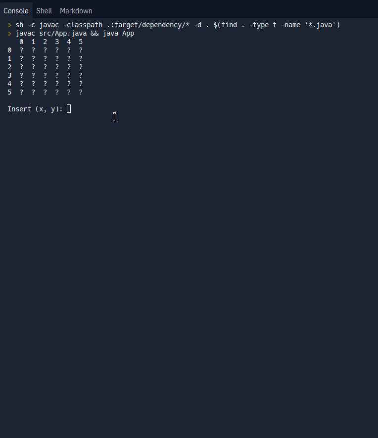

# CLI Minesweeper


> Play Minesweeper using the command line!

## Download


> Download .jar binaries are available on the [releases page](https://github.com/lucasferreiraz/minesweeper/releases).

## [Live Demo](https://replit.com/@LucasFerreira67/minesweeper)

> Hosted on the repl.it platform (Click play in the center box or click the green button in the upper right corner to run the program).




## How to Run


### Windows

> To run the binary and play simply double click on the .jar file or enter the directory where the file is and run:

 ```shell
 java -jar minesweeper-currentversion.jar
 ```

 

 ### Linux

> Run the following command on your Linux distribution:

  ```shell
  java -jar minesweeper-currentversion.jar
  ```


## How to Play

> Enter the coordinate:

`x` for the row and `y` for the column.

`1` to open the field and `2` to (un) mark that field as unsafe.
